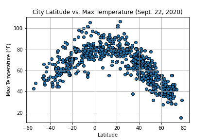
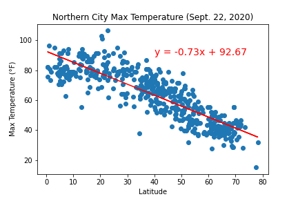
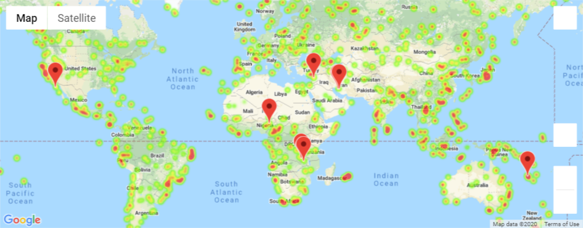

# Weather Data Analysis
The purpose of this project is to analyze weather data from various cities across the world, and selecting a potential vacation spot that fits all the wanted weather conditions.

### Dataset Sources:
* https://openweathermap.org/api

---

### Project Description
**Step 1: WeatherPy**
* Randomly select 2000 sets of latitude and longitude, find the nearest city on the picked set (discard repeated cities), and perform weather API calls and gather various weather data.
* Create scatter plot on the following:
  1. Temperature (F) vs. Latitude
  2. Humidity (%) vs. Latitude
  3. Cloudiness (%) vs. Latitude
  4. Wind Speed (mph) vs. Latitude
* Create linear regression on the below relationships:
  1. Northern Hemisphere - Temperature (F) vs. Latitude
  2. Southern Hemisphere - Temperature (F) vs. Latitude
  3. Northern Hemisphere - Humidity (%) vs. Latitude
  4. Southern Hemisphere - Humidity (%) vs. Latitude
  5. Northern Hemisphere - Cloudiness (%) vs. Latitude
  6. Southern Hemisphere - Cloudiness (%) vs. Latitude
  7. Northern Hemisphere - Wind Speed (mph) vs. Latitude
  8. Southern Hemisphere - Wind Speed (mph) vs. Latitude
* Example Screenshots:

**Step 2: VacationPy**
* Create a heat map that displays the humidity for every city from step 1.
* Narrow down the data to find the ideal weather condition below:
  1. A max temperature lower than 80 degrees but higher than 70.
  2. Wind speed less than 10 mph.
  3. Zero cloudiness.
* Using Google Places API to find the first hotel for each city located within 5000 meters of the coordinates.
* Plot the hotels on top of the humidity heatmap with map marker.

### Final Screenshot

